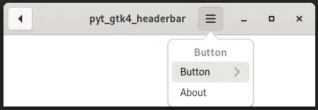

# pyt_gtk4_headerbar

 

## 内容 

Gtk.MenuButtonやGtk.Buttonを使用してGtk.HeaderBarにボタンを追加します。  
uiの作成には、cambalacheを使用します。

 

## 履歴

2024/6/8 プログラム作成  

cambalacheにより、Gtk.MenuButton内にPopoverやmodelを定義することができますが、それを使用して作成したのではエラーが生じて、正常に動作しませんでした。このため、Gtk.PopoverMenuをPython側で定義して、それにmodelを指定して、Gtk.MenuButtonのpopoverにセットしています。

 

## 参考にしたHP
